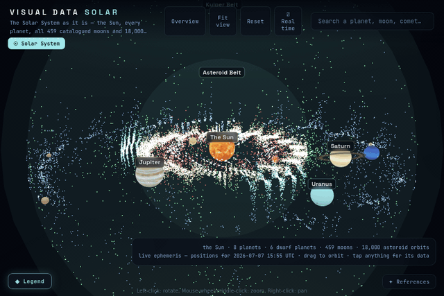

# Visual Data Solar — the Solar System, live, in real 3D

[](https://vdata.liako.eu/solar/)
[-f4f4f4?style=flat)](LICENSE)
[](https://threejs.org)
[](DATA.md)
[](DATA.md)
[](DATA.md)
[](DATA.md)




**Live: [vdata.liako.eu/solar](https://vdata.liako.eu/solar/)**

An interactive 3D map of the Solar System **as it is right now**:

- Planet positions computed from the JPL approximate ephemeris for the actual moment you
  are looking — and they keep moving in real time. A ⏱ control offers 1 day/s, 1 month/s
  and 1 year/s time-lapse of the same ephemeris.
- All 459 catalogued moons (NASA/JPL), orbiting at their true periods — Triton retrograde —
  with real spacecraft imagery for the major ones
- 18,000 real asteroid orbits (JPL Small-Body Database): main belt, Jupiter Trojans locked
  to L4/L5, trans-Neptunian objects — each advancing at its true Kepler rate
- Earth's planetary-defence picture (NASA/JPL CNEOS): potentially hazardous asteroids, the
  Sentry impact-risk list, close approaches mapped by real miss distance, fireballs at
  their true impact coordinates
- 15,932 active satellites (CelesTrak) in shells by real orbit size, circling at their
  real periods; 86 confirmed impact craters on Earth's surface
- Every object's panel shows its live heliocentric position and light-time from Earth

Every dataset is cited in the in-app **✦ References** panel and in [DATA.md](DATA.md). How each dataset is technically placed, sized and coloured — the rulers, the coordinate maths, and what is exact versus statistical — is documented in [METHODS.md](METHODS.md).

## Running locally

No build step — plain JavaScript, [Three.js](https://threejs.org) and
[3d-force-graph](https://github.com/vasturiano/3d-force-graph) from CDN (pinned to matching
revisions: a mismatch between the global THREE and the one bundled in 3d-force-graph makes
textures sample black).

```bash
python3 -m http.server 8000   # → http://localhost:8000/
```

`scripts/` holds the one-shot parsers that turned the raw catalogue downloads into the
compact JS data files the app ships with.

## Licence

Code is [MIT](LICENSE). **Not covered**: the catalogue-derived data files (see
[DATA.md](DATA.md) — they remain under their sources' terms), the NASA / Solar System
Scope imagery, and the LIAKO name and branding.

Sister projects: [visual-data-cosmos](https://github.com/liakomedia/visual-data-cosmos) ·
[visual-data-art](https://github.com/liakomedia/visual-data-art) — compiled by
[Liako](https://liako.eu).
